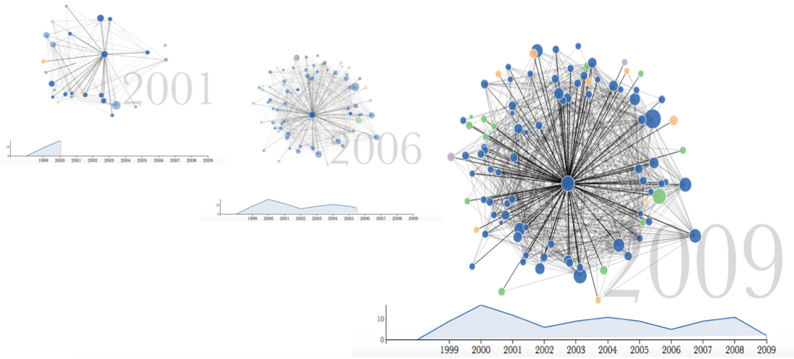

Visualizing Citation Networks Over Time
===============
Jason Portenoy, Muhammed Raza Khan {jporteno, mraza}@uw.edu

This was Jason's project, and he did the majority of the work. Raza helped with design suggestions and ideation. He also separately experimented with a Hive visualization that did not end up in the final version. Raza collaborated on the literature review. He also helped with qualitative labeling of clusters. Raza and Jason designed the poster together. Jason handled code development and writing the paper. The research/development process involved a lot of iterative coding and asking classmates, professors, friends, and family for their feedback. It also involved some data preprocessing (using SQL, Python, and JavaScript), chasing bugs, and trying to coordinate timed events using D3, jQuery, and Javascript.

---- (If you decide not to put these info in the project page put them down here-----

We developed a novel adaptation of the node-link diagram for representing scholarly literature as networks of papers connected by citations. In our visualization, the influence of a particular paper is viewed over time. The viewer watches as the network builds year by year following the paper's publication, seeing the relative impact that the paper has had both within its own field and across other fields. As the narrative visualization progresses, important points---such as a citation by a paper in a different field---are identified, and annotations are automatically generated which give the viewer context.

[Poster](https://github.com/CSE512-15S/fp-jporteno-mraza/final/poster-jporteno-mraza.pdf),
[Final Paper](https://github.com/CSE512-15S/fp-jporteno-mraza/final/paper-jporteno-mraza.pdf) 

## Running Instructions

Access our visualization at http://cse512-15s.github.io/fp-jporteno-mraza/ or download this repository and run `python -m SimpleHTTPServer 9000` and access this from http://localhost:9000/. Use full-screen mode for the best experience.

